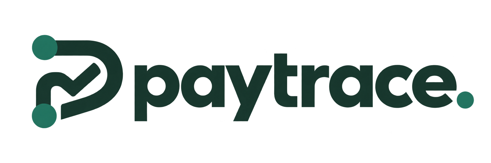

# PayTrace



**Every payment, accounted for.**

PayTrace connects a Monad USDC payment request to its customer checkout and finalized onchain evidence. A payer sends directly from their wallet; the server verifies the transfer; both sides can follow the result. No custodial keys, token allowances or fictional payment records are needed.

## Product

- Merchant workspace: persistent requests, exact amounts, expected payer, receiving wallet, internal notes, cancellation and CSV export.
- Customer checkout: wallet-assisted ERC-20 transfer on Monad Testnet, chain switching, account checks, gas estimation, manual transaction fallback and bounded automatic verification.
- Receipts: printable customer receipt and downloadable JSON evidence with token event, canonical block and finalization information.
- Review inbox: mismatches are explained without marking a request paid. Acknowledgement changes the review item, never the financial status.
- Historical funding: independently verified receipts, separated from customer payments.
- Guest-first request preparation and password-free wallet sign-in; isolated merchant workspaces, signed expiring HttpOnly cookies, origin checks, rate budgets, HTTPS configuration and persistent Docker deployment.
- Responsive interface, searchable requests, automatic workspace refresh and in-app user guide.

The main workspace starts empty. A real user-provided 20 test USDC funding transfer has been verified and saved in the developer's local database; wallet data and evidence are excluded from Git. The archived `/demo` route is a clearly labelled design prototype and is not the product's operational flow.

## Run

Node **24+** is required for `node:sqlite`.

```sh
npm ci
npm run dev
```

Open [PayTrace](http://127.0.0.1:3100). For the production build on your own computer:

```sh
npm run build
npm start
```

No secrets are needed for local operation. Both commands bind to loopback. The ledger API rejects remote hosts unless hosted authentication is configured.

## Verification rules

The server requires chain ID 10143, a successful receipt, a matching canonical block inside the provider's finalized range, the allowlisted Circle test USDC contract, the exact recipient and payer, and the exact integer amount. The transfer block must follow request creation. Mints cannot pay customer requests. Multiple incoming USDC events require review rather than automatic summing. An atomic unique claim prevents one event from paying two requests or being counted as both funding and a payment.

Only the server assigns receipts. The client cannot supply a trusted proof or set a request to received. Failed verification leaves its financial status unchanged. Cancellation does not reverse funds or stop an independently submitted wallet transfer.

## Tests and acceptance

```sh
npm test
npm run typecheck
npm run build
```

46 tests cover wallet calldata and account checks, session integrity, API/private data boundaries, exact reconciliation, database restart persistence, uniqueness, cancellation, review behavior and CSV safety. A production HTTP acceptance check also used live RPC evidence to confirm that an old real transfer cannot pay a new request, and that the rejection appears in the review inbox.

A fresh 1 test USDC transfer has now been matched to its prepared request and independently rechecked against the live RPC. The Vercel deployment passes hosted sign-in, database writes, checkout privacy, historical-transfer rejection and cancellation checks. Desktop dashboard and mobile checkout have been visually inspected. A fresh hosted wallet payment and final demo video remain user recording steps. Do not represent mocked test RPC fixtures as live payment evidence.

## Live release

- [Live PayTrace](https://paytrace-tau.vercel.app)
- [Public transaction verifier](https://paytrace-tau.vercel.app/verify)
- [User guide](https://paytrace-tau.vercel.app/guide)

Anyone can prepare a request at `/start` without signing in. Publishing asks for a wallet signature at `/login`, then returns to the draft for explicit review and publication. First sign-in creates a workspace; returning with the same wallet reopens it. Each account has an isolated workspace. Customer checkout links and the verifier remain public. The original owner workspace is preserved at `/owner` with its existing password.

## Deploy and demonstrate

- [Hosting and backup](docs/DEPLOYMENT.md)
- [Demo video walkthrough](docs/DEMO-VIDEO.md)
- [Release checklist and known limits](docs/RELEASE.md)
- [Judge-perspective review](docs/JUDGE-REVIEW.md)
- [Submission summary](docs/SUBMISSION-SUMMARY.md)
- In-app guide: `/guide`

## Current boundaries

Monad **testnet only**. No real-money bank payouts, fiat conversion, automatic refunds, team invitations or organization roles or unattended chain indexer. Customer verification runs while checkout is open, with a four-minute retry window; the transaction hash is retained locally where storage is available. Merchant status refreshes every 15 seconds. Vercel deployment uses remote Turso storage; a persistent single-process host can use local SQLite. Verification rate budgets remain per process.

Hosted links are shareable only after actual HTTPS deployment. Anyone with a checkout token can see its description, amount, wallet addresses and receipt; customer names and internal notes are omitted. Wallet signing needs an injected EIP-1193 provider. The in-app preview browser may have no wallet extension; use a supported browser or manual transfer/hash verification.

The RPC provider supplies the chain evidence; this app is not an independently validating consensus client. Test tokens have no monetary value, and receipt onchain does not mean bank settlement.

References: [Monad testnet](https://docs.monad.xyz/developer-essentials/testnet), [Circle USDC](https://www.circle.com/blog/now-available-usdc-cctp-wallets-and-contracts-on-monad), [EIP-1193 wallet API](https://eips.ethereum.org/EIPS/eip-1193), [EIP-3085 chain configuration](https://eips.ethereum.org/EIPS/eip-3085).

## Accounts and isolation

New accounts use EIP-4361 wallet signatures verified server-side with a five-minute, single-use challenge bound to an HttpOnly browser cookie and the application origin. No payment or allowance is requested. Standard externally owned wallets are supported; contract wallets and WalletConnect are not yet supported. Existing username/password accounts remain at `/password-login`, with recovery codes and session revocation. Wallet sign-in does not automatically link or migrate these records. No email verification or email recovery is offered. A merchant account owns one workspace. Requests, funding, notes, reviews and wallet settings are scoped on the server, never by a workspace ID from the client. Public checkout tokens expose only customer-facing fields and resolve their owning workspace internally. Duplicate evidence is prevented within each workspace; another account cannot reserve a public transfer to block its legitimate owner.

Existing records remain in the original workspace. New-account registration does not claim them. This is an initial multi-merchant testnet release, not an audited production payments service. No team permissions, email delivery or platform-wide abuse protection beyond current request budgets are claimed.
